This is a udemy course. The language is postgresql

spreadsheets:
- good for one time analysis
- good for reasonable data set size
- quickly need to chart something else
- ability for untrained people to work with

database:
- data integrity, hard to change
- can handle massive amounts of data
- quickly combine different data sets
- can support data for websites

- spreadsheet tabs = database tables. You can think of it that way.
- columns in spreadsheet are columns in database
- rows in spreadhseets, rows in database.

various sql:
- postgresql
- mysql
- ms sql server express
- microsoft access
- sqllite
- mariasql

sql = structured query language  
**But this sql learned in this course can be applied to a variety of databases!**


## Section 2

#### SELECT queries:
- `Select col1, col2 from <table>`  
selects 2 columns from a table
  
- usage of * in selects might increase traffic between server and application. Try to query only specific columns.

- cases don't matter in sql \

#### DISTINCT queries:

`SELECT DISTINCT(rating) FROM film;`

#### COUNT queries:
- returns the number of input rows that match specific condition of a query

To count distinct names from a table:

`SELECT COUNT(DISTINCT(name)) from table;`

That will return a number

Parenthesis are necessary for here because `SELECT COUNT DISTINCT(name)) from table;` tells postgres to count a column called DISTINCT which doesn't exist.

How many distinct districts are customers from?

```sql
SELECT COUNT(DISTINCT(district))
FROM address;
```

#### WHERE queries:
- you can use operators like =, <> (not equal), AND, OR, NOT, <=

`SELECT name, choice, from <Table> where name = 'David'`
`SELECT name, choice, from <Table> where name = 'David' AND choice = 'Red'`
- you need to use single quotes.

```
SELECT title FROM film 
WHERE rental_rate > 4 
AND replacement_cost >= 19.99
AND rating='R';
```

the above is a query about movies where the rental rate cost is greater than 4 and the replacement cost is greater than or equal to 19.99 and the rating is R.

to count it you can do:

```
SELECT COUNT(title) FROM film 
WHERE rental_rate > 4 
AND replacement_cost >= 19.99
AND rating='R';
```

you can use COUNT(*) but the above query is more descriptive and informative and what the query is about.

### ORDER BY queries
- you can order by multiple columns:
```sql
SELECT company, name, sales FROM table ORDER BY company DESC, sales ASC
```

the second column is the secondary sort.
You can actually sort by columns that are not in select statement. It will still work.

```sql
SELECT  first_name, last_name FROM customer
ORDER BY store_id DESC, first_name ASC
```

### LIMIT queries:
- LIMIT goes at the end
- select only a few rows
- useful with ORDER BY to get top N rows of something

5 most recent payments:
```sql
SELECT * from payment
ORDER BY payment_date DESC
LIMIT 5;
```

#### BETWEEN queries:
- value >= low AND value >= high
- value BETWEEN low and high

- between is inclusive but NOT BETWEEN is not inclusive
- can be used in dates, must be in ISO format. date BETWEEN '2007-01-01' and '2007-02-01'. ISO is YYYY-MM-DD

payments between 8 and 9 dollars:
```sql
SELECT * From payments
WHERE amount BETWEEN 8 and 9
```

when using timestamps, it only goes up to 0:00 or midnight of that day so if you want payments on the 14th you have to write:

```sql
SELECT * from payment
WHERE payment_date BETWEEN '2007-02-01' AND '2007-02-15'
```


#### IN queries:

- checks to see if value is included list of multiple options

```sql
SELECT color FROM table where color IN ('red', 'blue')
```

the IN is like an OR statement

Other examples:
```sql
SELECT COUNT(*) from payment
WHERE amount IN (0.99, 1.98, 1.99)
```

```sql
SELECT DISTINCT(amount) from payment
WHERE amount IN (0.99, 1.98, 1.99)
ORDER BY amount;
```

you can use `NOT IN` too.


### LIKE and ILIKE
- pattern matching with strings
- useful for questions like "all emails ending in '@gmail.com'"
or all names that begin with 'A'
  
you can use wildcard characters % (any number of chars) and _ for single chars.

ALL names that begin with 'A':
- `WHERE name LIKE 'A%'`

All names that end with an 'a':
- WHERE name LIKE '%a'

notice the percentage sign can be anywhere.

LIKE is case sensitive.\
ILIKE is not case sensitive.

underscore (_) is just for single characters\
`...WHERE title like 'Mission Impossible _'`

for 2 characters, you can use 2 underscores!

to match Cheryl, Theresa, and Sherri you could do: `...WHERE name LIKE '_her%'`

for case insensitive:

```sql
SELECT * FROM customer
WHERE first_name ILIKE 'j%' AND last_name ILIKE 's%'
```

people with 'er' anywhere in the name:

```sql
SELECT * FROM customer
WHERE first_name ILIKE '%er%' OR last_name ILIKE '%er%'
```

`NOT LIKE` is also viable

# GROUP BY statements
GROUP BY allows us to aggregate data and see how data is distributed by category
HAVING - filtering with a GROUP BY

Main purpose is for single output from multiple inputs.\
Many aggregate functions, MAX, MIN, SUM, AVG, COUNT
- happy only in SELECT or HAVING clause.
- AVG returns a floating point with many decimals but then you can use ROUND to specify precision.

Aggregate functions are functions so you need parenthesis.\
Some examples:

```sql
SELECT MIN(replacement_cost) FROM film;
```

Below doesn't work because `MIN(replacement_cost)` only returns 1 value and so what film_id would you even associate with that? You need to use GROUP_BY. 
```sql
SELECT MIN(replacement_cost), film_id FROM film;
```


You can do:
```sql
SELECT MIN(replacement_cost), MAX(film_id) FROM film;
```

For avg and rounding:

```sql
SELECT ROUND(AVG(replacement_cost), 2) FROM film;
```


#### GROUP BY
- aggregate columns by some category
First you need to choose a categorical column to run the GROUP BY on. COULD be numbers, but are non-continuous but are still categories. Categorical columns could still be numeric like class levels on a ship or something.
  
Remember, aggregate function takes multiple values and reduces it to 1. GROUP by splits it up and then each section is run into the aggregate function.


syntax:
```sql
SELECT category_col, AGG(data_col)
FROM table
GROUP BY category_col
```

GROUP By must appear after FROM or where.

In the SELECT statement, columns must either have an aggregate statement function OR be in the GROUP BY call. If thecolumn is just being selected, it just be in the GROUP BY statement.

Can have multiple GROUP BY:

```sql
SELECT company, division, SUM(sales)
FROM finance_table
GROUP BY company, division
```
the above is number of sales per company per division.

**WHERE statements do not refer to the aggregation result, that should be what the HAVING statement is for. HAVING is for filtering GROUP BY aggregations** The WHERE Filtering happens before the GROUP BY statement.

IF you want to sort using ORDER, reference the entire function:

```sql
SELECT company, SUM(sales)
FROM finance_table
GROUP BY company
ORDER BY SUM(sales)
LIMIT 5
```

If you want to sort results based on the aggregate, reference the entire function.

Find customers who spent the most in order:
```sql
SELECT customer_id, SUM(amount) FROM payment
GROUP BY customer_id
ORDER BY SUM(amount) DESC
```

How much each customer spent with each staff member:

```sql
SELECT customer_id, staff_id, SUM(amount) FROM payment
GROUP BY customer_id, staff_id
ORDER BY customer_id
```


days with least amount transcations in terms of $$$:
```sql
SELECT DATE(payment_date), SUM(amount) FROM payment
GROUP BY DATE(payment_date)
ORDER BY SUM(amount) DESC
```

avg replcement cost of movies by film rating:
```sql
SELECT rating,
ROUND(AVG(replacement_cost), 2)
FROM film
GROUP BY rating
```

top 5 customers payments to award coupons to later:
```sql
SELECT customer_id, SUM(amount)
FROM payment
GROUP BY customer_id
ORDER BY SUM(amount) DESC
LIMIT 5
```

#### HAVING clause

What if we wanted to filter based on the `SUM(sales)` here? WHERE cannot do that. We need HAVING


Using WHERE, the sum(sales) doesn't happen until after the GROUP BY and WHERE and GOOGLE will be left out here.

We can write `HAVING SUM(sales) > 1000`

To find companies with sales > 1000 properly:


```sql
SELECT customer_id, SUM(amount) FROM payment
GROUP BY customer_id
HAVING SUM(amount) > 100
```

Number of customers per store:
```sql
SELECT store_id, COUNT(customer_id) FROM customer
GROUP BY store_id
HAVING COUNT(customer_id) > 300
```


## JOINS

- AS clause or aliasing
- discussing FULL joins, INNER joins, OUTER joins, UNIONS
- once you understand one join, you'll get the others quickly!

#### AS clause

Aliases can clarify:

```sql
SELECT SUM(amount) as net_revenue
FROM payment;
```

**AS gets executed at end of query so you cannot use it in a WHERE. Cannot use the alias in a WHERE or GROUP BY segment. You can only use it in the SELECT**

You can do this:

```sql
SELECT customer_id, SUM(amount) AS total_spent
FROM payment
GROUP BY customer_id
HAVING SUM(AMOUNT) > 100
```

cannot do this:

```sql
SELECT customer_id, SUM(amount) AS total_spent
FROM payment
GROUP BY customer_id
HAVING total_spent > 100
```


#### INNER JOIN

Why do JOINS?
- allows us to combine multiple tables together
- WHY different JOINS? deal with data present only in one of the joined tables.

INNNER JOIN will result with the set of records that match in both tables.


INNER JOIN is the only join that is symmetrical, meaning you can switch the table you SELECT from and JOIN from and to and it'll be the same.

```sql
SELECT payment_id, payment.customer_id, first_name
FROM customer
INNER JOIN payment
ON payment.customer_id = customer.customer_id
```

is the same as:

```sql
SELECT payment_id, payment.customer_id, first_name
FROM payment
INNER JOIN customer
ON payment.customer_id = customer.customer_id
```


This example gives you back all the columns in an INNER JOIN:


If you want to filter out columns and there is a duplicate column name, you have to specify the table. If you want to SELECT a column that only appears in one of the tables, you don't need to specify the table name prior to the column name in the SELECT.


JOIN without the INNER; postgresql will treat it as an INNER JOIN.

#### OUTER JOins
- allows us to specify how to deal with values only being presnet in one of the tables being joined vs INNER JOIN which only gets rows with values in both tables.

FULL OUTER JOIN:
- also symmetrical: table order doesn't matter since we're grabbing eveerything.

To get opposite of INNER JOIN, you need to use WHERE with FULL OUTER JOIN, to get rows unique to each table in otherwise rows that are not found in both tables:

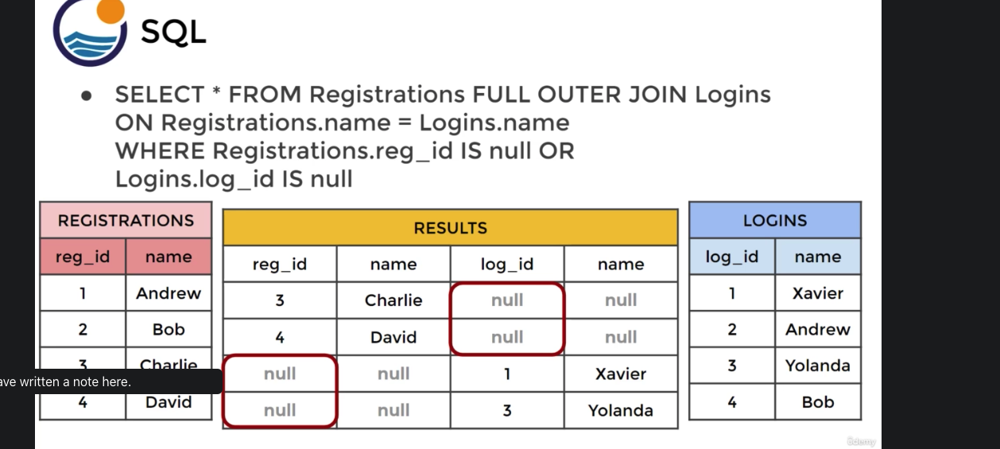

Another example: make sure we don't have payment info attached to a customer, or customer info not attached to payments. Let's see if we have any rows:

```sql
SELECT * FROM customer
FULL OUTER JOIN payment
ON customer.customer_id = payment.customer_id
WHERE customer.customer_id IS NULL
OR payment.customer_id IS NULL
```

That's how you would do it. That takes all the records at first using FULL OUTER JOIN then filters using WHERE

#### LEFT OUTER JOIN
- results in set of records that are in the left table, if there is no match with the right table, the results are null

- the SELECT and LEFT OUTER JOIN table matter since not symmetrical in the venn diagram. Order matters.

- below all rows are in TABLE A but we don't return anything exclusvie to table B in:

```sql
SELECT * FROM TABLE A
LEFT OUTER JOIN TABLE B
ON TABLEA.col_match = TABLEB.col_match
```


notice things that were exclusive to table B we don't see in the left outer join. so we can see that table order matters.

To get the venn diagram where only the left part of the left circle is shaded, use WHERE.


rows exclusive to table A:


LEFT JOIN = LEFT OUTER JOIN in sql. same thing syntacically.

IN this query:
```sql
SELECT film.film_id, title, inventory_id, store_id
FROM film
LEFT JOIN inventory ON
inventory.film_id = film.film_id
```

all rows from film will appear because film is on left side. You'll only see rows from film or in both film or inventory, but not in inventory and not film. Some of the rows returned will have NULL for inventory_id

#### RIGHT JOIN
- same thing as a LEFT JOIN but the tables reversed. You could just switch order of tables in a LEFT JOIN and it's = RIGHT JOIN
- return back rows exclusively in table B (The right join table) or both table B and table A. Do not return back rows from table A (the non right join table).

- use a where tableA.id IS NULL to only return back rows exclusively in table B.


#### UNION operator
- used to combine results of 2 or more SELECT statements. serves to concatenate 2 results together.

ex:
```sql
SELECT column_name(s) FROM table1
UNION
SELECT column_name(s) FROM table2
```

should be able to stack results on top of each other. The rows should be pastable on top of each other so same columns.


#### Example of a Multiple JOin query:

```sql
SELECT title, first_name, last_name FROM actor as act
    INNER JOIN film_actor as factor ON
        factor.actor_id = act.actor_id
    INNER JOIN film as f ON
        f.film_id = factor.film_id
WHERE first_name = 'Nick' AND last_name = 'Wahlberg'
```

We needed to join 3 tables here in the above query. Find distinct titles of Nick Wahlberg films.

vid here: https://www.udemy.com/course/the-complete-sql-bootcamp/learn/lecture/18997814#overview


## Advanced Topics Section 6
Topics are:
- timestamps and extract
- math functions
- string functions
- sub-query
- self-joins

Postgresql can hold:
TIME - contains only time (hours minutes and seconds)
DATE - contains only date (only date month day and year)
TIMESTAMP - contains date and time (both)
TIMESTAMPZ - containts date, time, and timezone

you may not need TIMESTAMPZ. For keeping track of worker hours, you just need the time they clocked in and the time they clocked out... so only TIME.

```sql
SHOW TIMEZONE
```
The above shows the timezone we're working in.

```sql
SELECT NOW()
```
gets timestamp in timestamp data format:


```sql
SELECT TIMEOFDAY()
```


this is a string, not a timestamp


The below gets your just the date, not a function call:
```sql
SELECT CURRENT_DATE
```


#### EXTRACT function

- allows you to get a subcomponent of a date value: like the year, month, day, quarter, week

If you have a full timestamp, and you just want a year, you can get just the year

```sql
EXTRACT(YEAR from date_col)
```

example:

```sql
SELECT EXTRACT(YEAR FROM payment_date) myyear
FROM payment
```

results:


#### AGE

calculates current age of a timestamp in relation to current date
```sql
AGE(date_col)
```

takes current date and calculate how old timestamp in database is. If today is 2020, and column is 2000, returns 20 years.

example:

```sql
SELECT AGE(payment_date) as myyear
FROM payment;
```


results:


combine:


To find number of payments on a monday:

```sql
SELECT COUNT(*)
FROM payment
WHERE EXTRACT(dow from payment_date) = 1;
```

#### to_char
- general function to convert date types to text

```sql
TO_CHAR(date_col, `mm-dd-yyyy`)
```

```sql
SELECT TO_CHAR(payment_date, 'dd/mm-YYYY')
FROM payment;
```

the last argument is the text formatting which you can use dashes or slashes to format:

example:


#### Mathematical Operators
- you can apply operators to one or more columns
- everything is available to you in postgresql, even bitwise

even functions: abs(), log(), round(), power() and trig functions and random() for complex sql queries.

examples:

```sql
SELECT ROUND(rental_rate/replacement_cost, 4) * 100 AS percent_cost 
FROM film
```
The above is percentage cost of rental rate of replacement cost


#### String Functions
- you can also do string functions

functions that you can run:
- string concatenation
- substring and searching YOu can extract substring from
- lower case
- position index
- length of string
etc

examples:
```sql
SELECT LENGTH(first_name) FROM customer
```

```sql
SELECT first_name || ' ' || last_name FROM customer AS full_name
```
the above adds a space in between first and last name


first letter and non-capitalized last name in an email:

```sql
SELECT LEFT(first_name, 1) || LOWER(last_name) || '@gmail.com' FROM customer AS full_name
```


#### Subqueries
Let's look at subqueries that return a value, subqueries using EXISTS

How to find students who did better than avg grade:

First part, find the avg grade:
```sql
SELECT AVG(grade) from test_scores
```

second part is something like this which finds the student and grade from a table:

```sql
SELECT student, grade
FROM test_scores
```

then find students above the avg:
```sql
SELECT student, grade
FROM test_scores
WHERE grade > (SELECT AVG(grade) 
FROM test_scores)
```

subquery gets run first inside the parenthesis and returns a value so that the query is like:

```sql
SELECT student, grade
FROM test_scores
WHERE grade > 70
```

previously you would have to run 1 query and use the reuslt in another in two steps. This allows us to do it in one step.

Using IN in subquery:
Instead of join, you can use IN to see if student is in a list

```sql
SELECT student, grade
FROM test_scores
where student IN
(SELECT student
    FROM honor_roll_table)
```

the above is easy to reason above, more so than a join.


More examples:
films where the rental rate is greater than avg:
```sql
SELECT title, rental_rate
FROM film
WHERE rental_rate > 
(SELECT AVG(rental_rate) FROM film)
```

subquery returns multiple results so use the IN operator. This query gives back film titles where the film_id is in the subquery list. We needed to do this because the film_id isn't in the rental table. Inventory does have the film_id and the rental_table does have an inventory_id so we can join inventory and rental tables using `inventory_id`. Below, the sub_query gives back a list of film_ids which you can then use to select films and titles from another table (the film table)


The following returns customers who made payment over $11 using EXISTS in the subquery:
```sql
SELECT first_name, last_name
FROM customer AS c
WHERE EXISTS(
    SELECT * FROM payment as p
    WHERE p.customer_id = c.customer_id
    AND amount > 11
)
```

the subquery checks if the payment > 11 exists for the customer and if so, the main query will return the first and last_name

NOT also works with EXISTS:

```sql
SELECT first_name, last_name
FROM customer AS c
WHERE NOT EXISTS(
    SELECT * FROM payment as p
    WHERE p.customer_id = c.customer_id
    AND amount > 11
)
```


#### Self-Join
- a query in which a table is joined to itself.
- Self-joins are useful for comparing values in a column of rows within the same table.
- same table in both parts of the JOIN
- you need an alias otherwise table names would be ambiguous

example:
```sql
SELECT tableA.col, tableB.col
FROM table as tableA
JOIN table as tableB ON
tableA.some_col = tableB.other_col
```
notice the aliases are used in the JOIN part where the = sign is used.


This is when to use a self join:
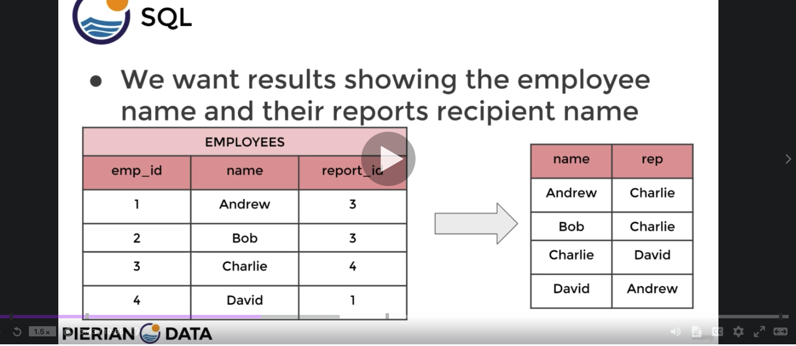


To find movies with the same runtime (same table!):
```sql
SELECT f1.title, f2.title, f1.length
FROM film as f1
INNER JOIN film as f2 ON 
f1.film_id != f2.film_id
AND f1.length = f2.length
```

notice the != in the first ON clause of the INNER JOIN because we want to see films with the same length as other films, not itself.


## Assessment 2
Question 1:
```sql
SELECT * from cd.facilities
```

Question 2:
```sql
SELECT name, membercost from cd.facilities
```


Question 3:
```sql
SELECT name, membercost from cd.facilities
WHERE membercost > 0
```


Question 4:
```sql
SELECT facid, name, membercost, monthlymaintenance from cd.facilities
WHERE membercost < (facilities.monthlymaintenance/50)
AND membercost > 0;
```


Question 5:
Remember about LIKE
Two of the important selectors in pattern matching with LIKE/ILIKE are the percentage sign(%) and underscore(_).

% sign in a pattern matches any sequence of zero or more characters.
_ in a pattern matches any single character.

For instance, consider the following query:

```sql
SELECT string FROM string_collection WHERE string LIKE 'O%';
```

answer:
```sql
select * from cd.facilities
WHERE name LIKE '%Tennis%';
```

or

```sql
select * from cd.facilities
WHERE name ILIKE '%tennis%';
```

Question 6:
```sql
SELECT * from cd.facilities
WHERE facid IN (1, 5);
```

Question 7:

so `joindate` is a timestamp:
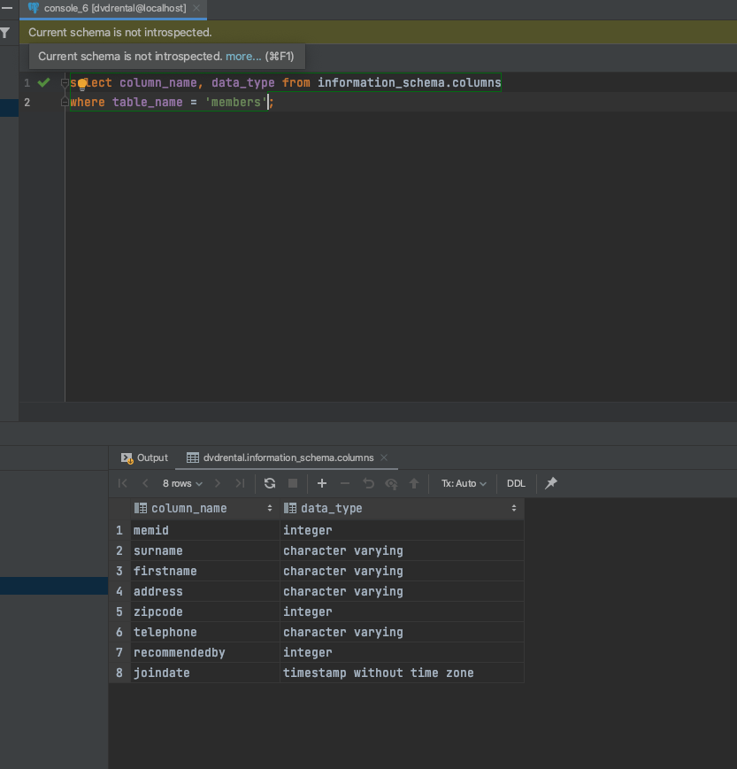

```sql
SELECT memid, surname, firstname, joindate 
FROM cd.members
WHERE joindate >= '2012-09-01';
```

Question 8:

```sql
select DISTINCT(surname) from cd.members 
order by surname 
limit 10;
```

Question 9:
```sql
select TO_CHAR(joindate, 'YYYY:mm:dd hh24:MI:ss')
from cd.members
order by (joindate) DESC
limit 1;
```

or

```sql
```sql
select MAX(joindate)
from cd.members;
```

Question 10:
```sql
SELECT COUNT(*) from cd.facilities
WHERE guestcost > 10;
```

Question 11:
```sql
SELECT facid, SUM(slots) as total_slots
FROM cd.bookings
WHERE starttime >= '2012-09-01' AND starttime <= '2012-10-01'
GROUP BY facid
ORDER BY SUM(slots);
```
 notice you have to order by `SUM(SLOTS)` and not `total_slots` because the aliases are done last.

Question 12:
```sql
SELECT cb.facid, SUM(slots) as total_slots
FROM cd.bookings as cb
INNER JOIN cd.facilities as cf
ON cb.facid = cf.facid
GROUP BY cb.facid
HAVING SUM(slots) > 1000
ORDER BY facid ASC;
```

Question 13:
```sql
SELECT cb.starttime AS start, cf.name as name
FROM cd.bookings as cb
INNER JOIN cd.facilities as cf
ON cb.facid = cf.facid
WHERE TO_CHAR(cb.starttime, 'YYYY-MM-DD') = '2012-09-21'
AND name IN ('Tennis Court 1', 'Tennis Court 2')
ORDER BY cb.starttime ASC, name;
```


Question 14:


## Section 8
- a primary key is a column or group of columns used to identify a row uniquely in a table. Can be used for joining tables together.
- A foreign key is a field or group of fields that uniquely identifies a row in another table
- It references to the primary key of the other table.

- The table that contains the foreign key is the referencing table or child table.
- The table to which the foreign key references is called referenced table or parent table.

#### Contraints
- rules enforced on data columns in a table
- They are used to prevent invalid data from being entered in a database
- this ensures accuracy

two main categories:  
Column Constraints and Table Contraints

Common COLUMN ones:
- NOT NULL constraint. Ensure column cannot have NULL value.
- UNIQUE constraint - ensures that all values in a column are different.
- Primary key and Foreign key
- CHECK constraint - ensures that all values in a column satisfy certain conditions
- EXCLUSION - if any 2 rows are compared on the specified column or expression using the specified operator, not all of the comparisons will return TRUE.


Table constraints:
- CHECK
- REFERENCES - to constrain the value stored in the column that must exist in a column in another table.
- UNIQUE(column_list) - you can pass in multiople columns so values have to be unique across multiple columns
- Primary key (column_list) - usually just 1 primary key but you can have multiple primary key columns


# Section 8: creating databases

## Create Table
In datagrip, you can connect to the dvdrental database that you created using:
```bash
psql -h localhost -p 5432 -U jwan -d dvdrental
```

we already created a database and user with:
```sql
createdb dvdrental
createuser jwan
```

- serial is used for the primary key. makes sure the primary key is unique so the user doens't have to provide a value for the primary key column.
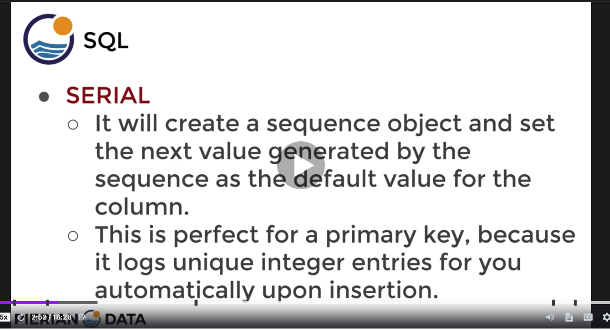

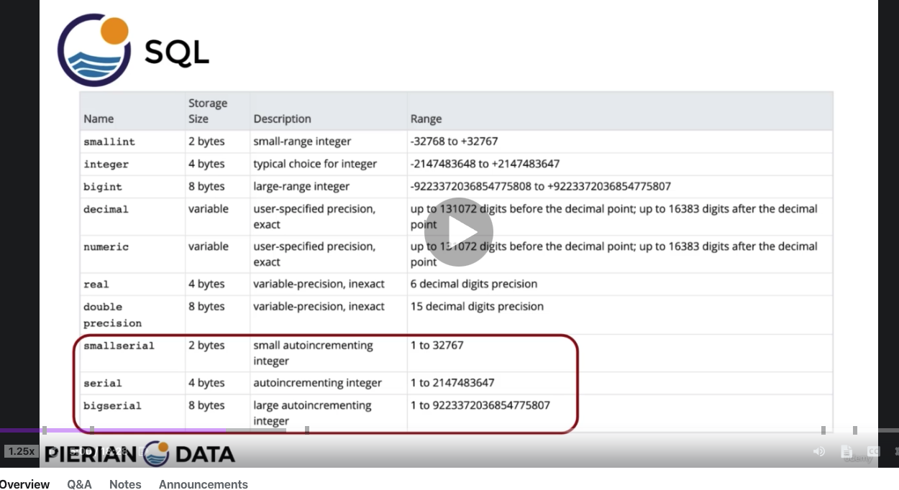

example syntax:
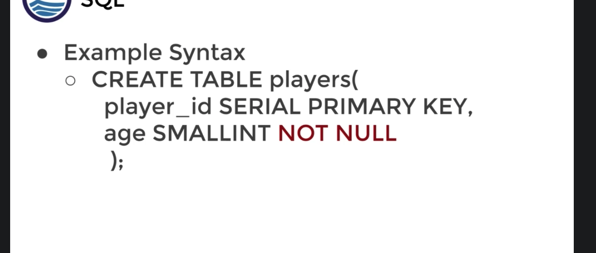


Here's the joined table:

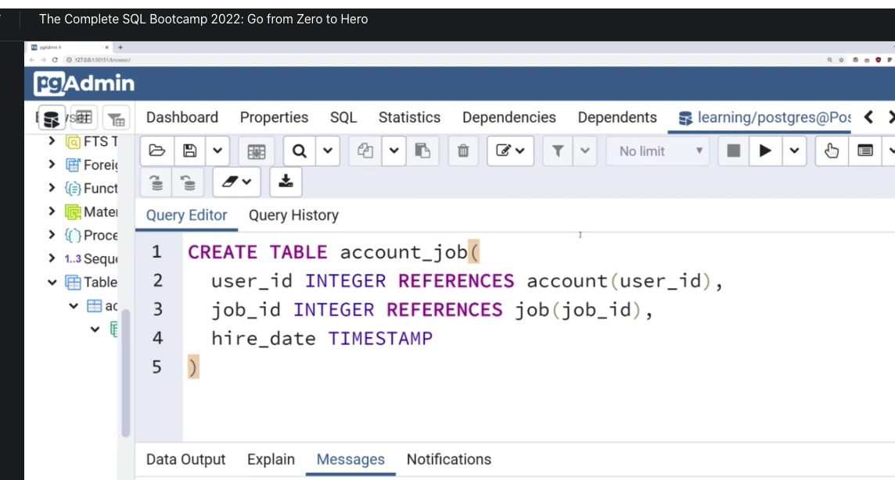
- Notice the foreign key is of integer type in the `account_job` table and you need to use `references` for the other table.


## Inserts


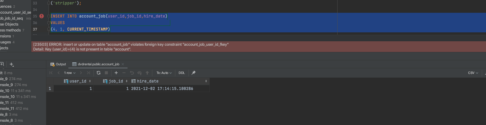
the above happens when you try to insert into a column that has a REFERENCES constraint when using an integer value that isn't a primary key in the specified table.

The ddl for the account_job table:
```sql
create table account_job
(
    user_id   integer
        constraint account_job_user_id_fkey
            references account,
```
So since 4 is not a `user_id`, you cannot insert 4 into the account_job table in the `user_id` column


this fails because the last insert value is larger than the varchar length:
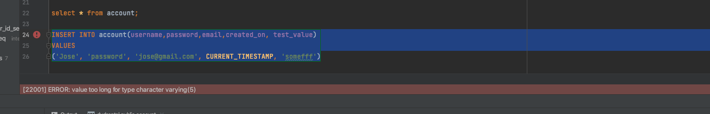


## DELETE

- we can delete rows in a table based on conditions of another, like a match of an id between 2 tables.

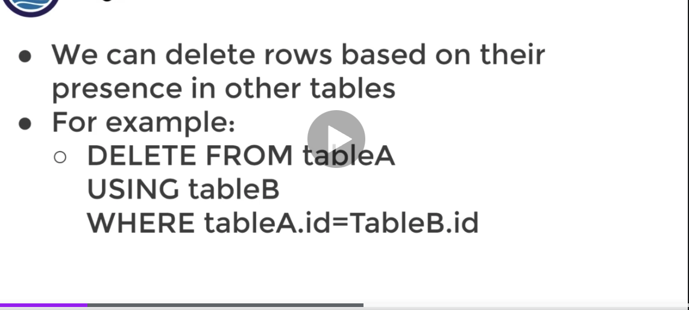


## Update

You can use the Update + Set syntax to update rows in a table. 

general syntax:
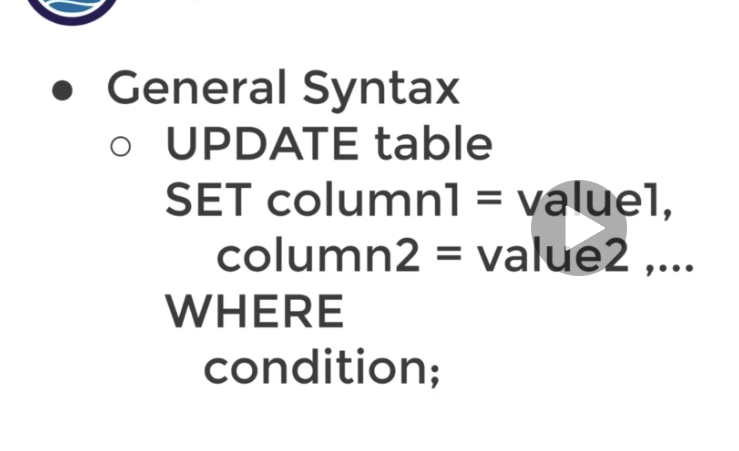

This returns you the rows that were updated:


update based on the value of another table:
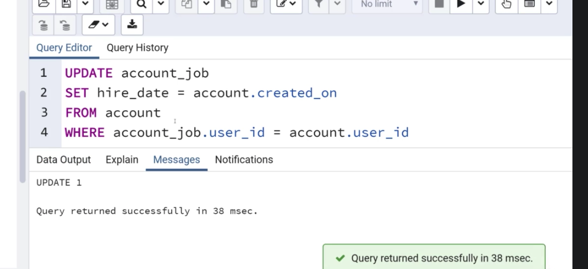


## Alter Table

Some alter table examples:

Say we have a table like this:

```sql
CREATE TABLE information(
    info_id SERIAL PRIMARY KEY,
    title VARCHAR(500) NOT NULL,
    person VARCHAR(50) NOT NULL UNIQUE
)
```

you can rename tables:

```sql
ALTER TABLE information
RENAME TO new_info

select * from new_info
```

You can rename columns:

```sql
ALTER TABLE new_info
RENAME COLUMN person to people
```

you can alter constraints:
Say you tried to do this:
```sql
INSERT INTO new_info(title)
VALUES
('some new title')
```

you'd get this error:

```sql
[23502] ERROR: null value in column "people" of relation "new_info" violates not-null constraint Detail: Failing row contains (1, some new title, null).
```

so you can alter the constraint
```sql
ALTER TABLE new_info
ALTER COLUMN people DROP NOT NULL
```

you can set a constriant with:

```sql
ALTER TABLE new_info
ALTER COLUMN people SET NOT NULL
```

## DROP

can drop a column, removes indexes and constraints for the column too

but does not remove views, triggers, or stored procedures. YOu need to add in cascade clause to remove the dependencies too

Basic syntax:

```sql
ALTER TABLE <table name>
DROP COLUMN <column name> < optional CASCADE>
```

check for existence to avoid error:

```sql
ALTER TABLE <table name>
DROP COLUMN IF EXISTS <column name> <optional CASCADE>
```
Cascade will remove additional dependencies on views and triggers if there are any.

To drop multiple columns:
```sql
ALTER TABLE <table name>
DROP COLUMN <column name 1>
DROP COLUMN <column name 2>
```

## Check Constraint

- more customized constraints that adhere to more specific constraints like number > 21 for age.
- you can also add constraints to compare with other columns.

```sql
CREATE TABLE Persons (
    ID int NOT NULL,
    LastName varchar(255) NOT NULL,
    FirstName varchar(255),
    Age int,
    CHECK (Age>=18)
);
```

# Assessment Three

```text
Assessment Test 3
Welcome to your final assessment test! This will test your knowledge of the previous section, focused on creating databases and table operations. This test will actually consist of a more open-ended assignment below:

Complete the following task:

Create a new database called "School" this database should have two tables: teachers and students.

The students table should have columns for student_id, first_name,last_name, homeroom_number, phone,email, and graduation year.

The teachers table should have columns for teacher_id, first_name, last_name,

homeroom_number, department, email, and phone.

The constraints are mostly up to you, but your table constraints do have to consider the following:

 We must have a phone number to contact students in case of an emergency.

 We must have ids as the primary key of the tables

Phone numbers and emails must be unique to the individual.

Once you've made the tables, insert a student named Mark Watney (student_id=1) who has a phone number of 777-555-1234 and doesn't have an email. He graduates in 2035 and has 5 as a homeroom number.

Then insert a teacher names Jonas Salk (teacher_id = 1) who as a homeroom number of 5 and is from the Biology department. His contact info is: jsalk@school.org and a phone number of 777-555-4321.

Keep in mind that these insert tasks may affect your constraints!
```

answer:

```sql
CREATE TABLE students(
student_id serial PRIMARY KEY,
first_name VARCHAR(45) NOT NULL,
last_name VARCHAR(45) NOT NULL, 
homeroom_number integer,
phone VARCHAR(20) UNIQUE NOT NULL,
email VARCHAR(115) UNIQUE,
grad_year integer);
```

To create the teachers table:
```sql
CREATE TABLE teachers(
teacher_id serial PRIMARY KEY,
first_name VARCHAR(45) NOT NULL,
last_name VARCHAR(45) NOT NULL, 
homeroom_number integer,
department VARCHAR(45),
email VARCHAR(20) UNIQUE,
phone VARCHAR(20) UNIQUE);
```

for inserting a student:
```sql
INSERT INTO students(first_name,last_name, homeroom_number,phone,grad_year)VALUES ('Mark','Watney',5,'7755551234',2035);
```


Then for inserting the teacher information:

```sql
INSERT INTO teachers(first_name,last_name, homeroom_number,department,email,phone)VALUES ('Jonas','Salk',5,'Biology','jsalk@school.org','7755554321');
```


# Conditional Expressions and Procedures

- let's look at case and coalesce, cast, nullif, and Views

## Case

execute sql code when certain conditions are met. Like If/Else.

General case vs Case Expression

General case syntax first:
```sql
CASE

WHEN condition1 THEN result1
WHEN condition2 THEN result2

ELSE some_other_result

END
```

simple example that will return 2 columns, again this is the general case statement:

```sql
SELECT a,
CASE 
    WHEN a = 1 THEN 'one'
    WHEN a = 2 THEN 'two'
ELSE 'other'
END 
FROM test;
```
the above will return a second column by default named `case` which conditionally evalutes column `a`. You use the case statement in lieu of a column.

Case expression syntax:
- first evaluates an expression than compares result with each value in the WHEN clause sequentially.


in front of CASE we evaluate an `expression`, like this:

```sql
CASE expression
when value1 THEN result1
when value2 THEN result2
ELSE some_other_result
end
```
and the WHEN's evaluate the values from `expression`.

## Case examples, both ways, generic and case expression

```sql
Select customer_id,
CASE
    WHEN (customer_id <= 100) THEN 'Premium'
    WHEN (customer_id BETWEEN 100 and 200) THEN 'Plus'
    ELSE 'Normal'
END AS customer_class
FROM customer
```

The following is an example of case expression. It implicitly checks equality:

```sql
Select customer_id,
CASE customer_id
    WHEN 2 THEN 'Winner'
    WHEN 5 THEN 'Loser'
    ELSE 'Did not play raffle'
END AS customer_raffle_results
FROM customer
```

perform operations on results of case statements:

```sql
SELECT
CASE rental_rate
    WHEN 0.99 THEN 1
    ELSE 0
END
from film
```

What's nice about this is you can add up the case column since you've used 1s and 0s.

```sql
SELECT
SUM(CASE rental_rate
    WHEN 0.99 THEN 1
    ELSE 0
END) as number_of_bargains,
SUM(CASE rental_rate
    WHEN 4.99 THEN 1
    ELSE 0
END) as premiums
from film
```

We're calling functions (`SUM`) on results of a case column.

## COALESCE

- accepts and unlimited number of arguments, returns first argument that is not NULL. If all args evaluate to NULL, then it returns NULL

`SELECT COALESCE(null, 2,3)` returns 2

when you query a table that contains NULLs, and you're trying to do an operation on the returned values, you can use `COALESCE`.

IN sql, price - discount would = NULL if discount was null. Oddd I know. So you can do: `price - COALESCE(discount,0)` instead.

**Keep COALESCE in mind in case you encounter a table with null values that you wnat to perform operations on**
- especially true if you don't want to change the table itself. sometimes the null values are desired values in the talble


## CAST

